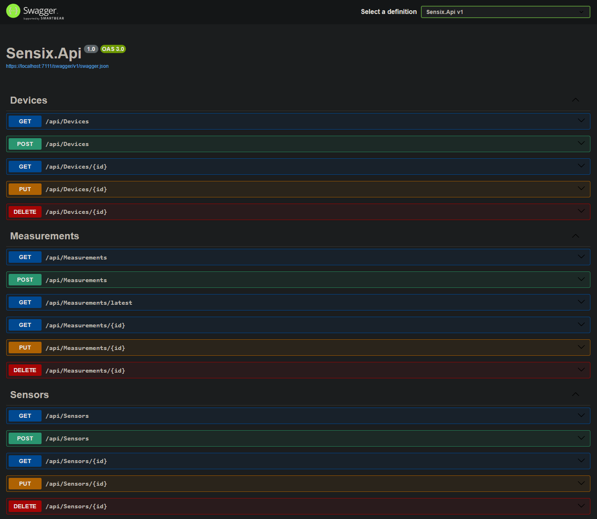

<h1 align="center"></h1>

<p align="center"><b>A modular REST API for ingesting, processing, and visualizing sensor data</b></p>

---

The project (.NET 8 SDK) provides a structured, extensible pipeline powered by PostgreSQL, AutoMapper, DTO layers, and a clean controller design.

---

## Project Structure

```bash
src/
  backend/
    Sensix.Api/             # ASP.NET Core API (Swagger UI, Controllers, DTOs)
    Sensix.Infrastructure/  # EF Core, PostgreSQL, Migrations
  frontend/
```

---

## Features

- CRUD endpoints for **Devices**, **Sensors**, and **Measurements**  
- Paging & filtering through `PagingQuery` and `FilterMeasurementDto`
- **AutoMapper** for DTO ↔ Entity mapping  
- **PostgreSQL** with EF Core migrations  
- **Swagger UI** for live API testing  
- Clean, layered architecture

---

## Current State

#### Swagger UI Overview


#### PostgreSQL Database Schema


---

## Example API Flow

1. **Create Device**
   ```json
   POST /api/Devices
   {
     "name": "Dev-PC-Lab",
     "description": "Test device",
     "location": "Lab A"
   }
   ```

2. **Create Sensor**
   ```json
   POST /api/Sensors
   {
     "deviceId": "<device-guid>",
     "name": "CPU Temperature",
     "unit": "°C"
   }
   ```

3. **Create Measurement**
   ```json
   POST /api/Measurements
   {
     "sensorId": "<sensor-guid>",
     "value": 42.5,
     "timestampUtc": "2025-12-02T20:15:00Z",
     "unit": "°C"
   }
   ```

4. **Query Measurements**
   - `/api/Measurements` → returns paged results  
   - `/api/Measurements/latest` → returns most recent record  

---

## Architectural Principles

- **Separation of Concerns:** Clear division between API, Domain, and Infrastructure layers  
- **DRY:** Shared paging logic via `PagingQuery`  
- **DTO/Entity Mapping:** AutoMapper ensures clean translation between layers  
- **Database-first Design:** PostgreSQL-backed EF Core migrations  

---

## Planned Extensions

- [ ] Frontend visualization (Web dashboard or WPF client)  
- [ ] Measurement history chart

---

## Tech Stack

- .NET 8
- ASP.NET Core Web API
- Entity Framework Core (PostgreSQL)
- AutoMapper
- Swagger / OpenAPI 3.0