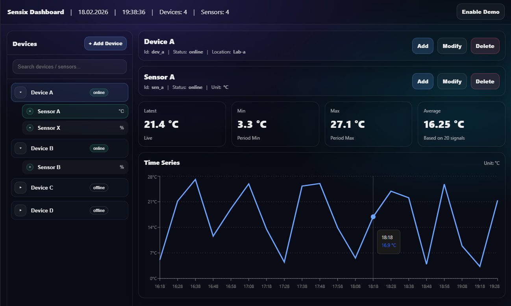

<h1 align="center"></h1>

<h4 align="center" fontsize="10"><b>Full-stack sensor monitoring system with time-series visualization</b></h4>

---



---

## 🚀 Quick Start

```bash
# Clone and start the entire stack via Docker
docker-compose --profile all up --build
```

---

## 📄 Services Overview

| Service | URL | Tech Stack |
| :--- | :--- | :--- |
| **Frontend** | `localhost:3000` | `React`, `Vite`, `TypeScript`, `Recharts` |
| **Backend** | `localhost:5000/swagger` | `ASP.NET Core (.NET 8)`, `EF Core` |
| **Database** | `localhost:5432` | `PostgreSQL` |
| **Tooling** | `-` | `Docker`, `Postman` |

---

## 🛠️ Architecture & Engineering

The backend follows a strict **Separation of Concerns** to ensure testability and scalability:

| Layer | Responsibility | Professional Value |
| :--- | :--- | :--- |
| **DTOs** | API Contracts | Contract Stability |
| **Controllers** | HTTP Handling | Clean API Surface |
| **Services** | Business Logic | Use Case Encapsulation |
| **Repositories** | Data Abstraction | Decoupled Persistence |
| **Entities** | Domain Model | Encapsulated Behavior |
| **DevOps** | Dockerization | Deployment Reliability |

---


## 📊 Core Domain Model

* **Devices:** Physical sources (e.g. RasperyPi 4)
* **Sensors:** Connected to device (e.g., temperature, humidity)
* **Measurements:** Collected data from sensor with UTC timestamps


---

## 🌳 Project Structure

```
sensix/
├── src/
│   ├── backend/
│   │   ├── Sensix.Api/          # API Layer: Controllers & Middleware
│   │   ├── Sensix.Lib/          # Core: Business Logic, Entities & Repositories
│   │   └── Sensix.sln
│   └── frontend/
│       ├── src/
│       │   ├── api/             # API Client
│       │   ├── components/      # UI Components & Modals
│       │   ├── pages/           # Route-level components
│       │   └── types/           # TypeScript Interfaces (Entities/DTOs)
├── docs/                        # Screenshots & Documentation
├── docker-compose.yml           # Infrastructure as Code
└── README.md
```

---

## 🎯 Purpose

This project serves as a practical example of building a clean, production-style full-stack system with a strong architectural foundation and clear data flow.