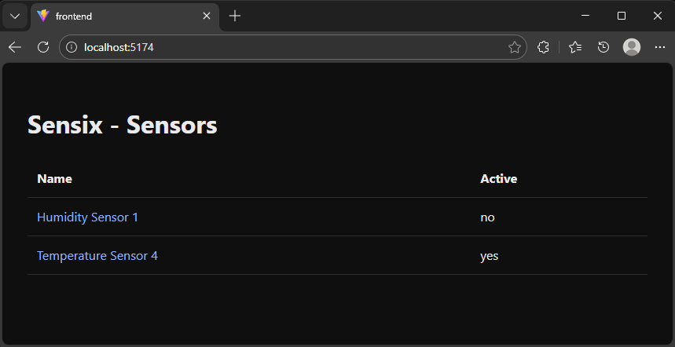
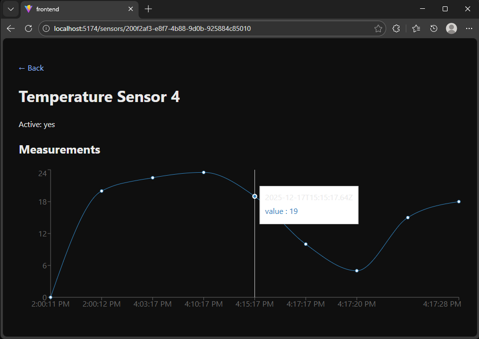

<h1 align="center"></h1>

<p align="center"><b>A lightweight system to collect, store, and visualize sensor data</b></p>

---

## Why Sensix

**Sensix** serves as a compact example of a full-stack, data-driven monitoring system with a clear domain model and time-series visualization.

It manages **devices**, **sensors**, and **time-based measurements**, exposes the data through a clean REST API, and visualizes measurement histories in a web UI.

The focus is clarity, clean data flow, and a maintainable architecture.

---

## How it works

1. A **Device** represents a physical or logical source (e.g. PC, machine, room)
2. A **Sensor** belongs to a device (e.g. temperature, humidity)
3. A **Measurement** stores a value with unit and UTC timestamp
4. The frontend fetches data from the API and renders time-series charts

---

## Frontend

The frontend provides a simple overview of sensors and their measurement curves.





---

## API (Swagger)

The backend exposes a REST API with full CRUD support for all core entities:

- Devices
- Sensors
- Measurements

All endpoints can be tested directly via Swagger UI.


---

## Database Model

The PostgreSQL schema follows a clear relational structure:

- **Devices → Sensors → Measurements**
- Measurements are stored as time-series data
- Designed for easy extension and querying


---

## Project Structure

```text
src/
  backend/
    Sensix.Api/             # ASP.NET Core API (Controllers, DTOs, Swagger)
    Sensix.Infrastructure/  # EF Core, PostgreSQL, Migrations
  frontend/                 # React Web UI
```

---

## Architecture

The system follows a clean, layered architecture with clearly defined responsibilities.

- **API / Controllers**  
  Controllers are responsible only for HTTP-related concerns such as routing, request validation, and returning appropriate status codes. They do not contain business logic.

- **Service Layer**  
  Services encapsulate the core business logic. They coordinate use cases, apply rules, and orchestrate interactions between repositories and other components.

- **Data Access / Repositories**  
  Repositories abstract database access and persistence logic. This keeps Entity Framework Core and PostgreSQL details isolated from the business layer.

- **DTOs (Data Transfer Objects)**  
  DTOs define stable API contracts between the backend and external consumers. They prevent direct exposure of domain entities and ensure controlled data flow.

This separation improves maintainability, testability, and long-term extensibility of the system.

---

## Tech Stack

- ASP.NET Core / .NET 8
- PostgreSQL + Entity Framework Core
- React (Vite)
- Swagger / OpenAPI 3.0